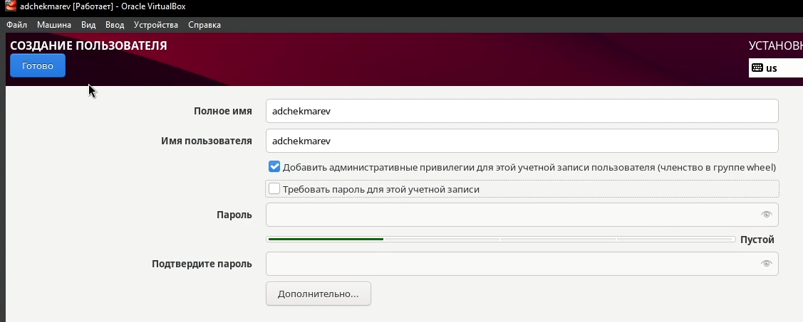

---
## Front matter
lang: ru-RU
title: Лабораторная работа №1
subtitle: Установка и конфигурация операционной системы на виртуальную машину
author:
  - Чекмарев Александр Дмитриевич | Группа НПИбд-03-24
institute:
  - Российский университет дружбы народов, Москва, Россия
date: 6 сентября 2025

## i18n babel
babel-lang: russian
babel-otherlangs: english

## Formatting pdf
toc: false
toc-title: Содержание
slide_level: 2
aspectratio: 169
section-titles: true
theme: warsaw

## Fonts
mainfont: Liberation Serif
romanfont: Liberation Serif
sansfont: Liberation Sans
monofont: Liberation Mono
mainfontoptions: Ligatures=TeX
romanfontoptions: Ligatures=TeX
sansfontoptions: Ligatures=TeX,Scale=MatchLowercase
monofontoptions: Scale=MatchLowercase,Scale=0.9
---

# Информация

## Докладчик

:::::::::::::: {.columns align=center}
::: {.column width="70%"}

  * Чекмарев Александр Дмитриевич
  * Группа НПИбд-03-24
  * Российский университет дружбы народов
  * <https://github.com/nenokixd?tab=repositories>

:::
::: {.column width="30%"}

:::
::::::::::::::

# Вводная часть

## Объект и предмет исследования

- Установка ОС Linux Rocky на VirtualBox

## Цель работы

- Целью данной работы является приобретение практических навыков установки операционной системы на виртуальную машину, 
настройки минимально необходимых для дальнейшей работы сервисов.

# Ход лаборатороной работы

## Скачивание дистрибутива Rocky v10

- Скачиваем iso-образ Rocky актуальной версии на сайте: https://rockylinux.org/ru-RU/download

{#fig:001 width=50%}

## Настройки в VirtualBox для Rocky

- Выбираем iso образ, название, место
- Выделяем ОЗУ
- Выделяем 40 гб

{#fig:001 width=30%} {#fig:001 width=30%} {#fig:001 width=30%}

## Загрузчик операционной системы GRUB

- При запуске нас встречает GRUB, выбираем "install Rocky Linux"

{#fig:001 width=50%}

## Меню настроек

- В данном месте у нас находится все что нужно для настройки

{#fig:001 width=50%}

## Язык и жесткий диск

- Выбираем нужный нам язык в пункте Языковая поддержка 
- Выбираем жесткий диск в пункте Место установки

{#fig:001 width=40%} {#fig:001 width=40%} 

## Программное обеспечение, узел и KDUMP

- Переходим в Выбор программ и отмечаем Средства разработки и Server with GUI
- Отключаем KDUMP 
- Изменяем имя узла в Имя сети и узла

{#fig:001 width=40%} {#fig:001 width=20%} {#fig:001 width=30%}

## Настройка аккаунта пользователя 

- Настраиваем аккаунт администратора, выдав ему root права
- Создаем пользователя 

 {#fig:001 width=45%} {#fig:001 width=50%}

## Конец настроек перед установкой

- Переходим к установке

{#fig:001 width=50%}

## Подключение образа диска дополнений гостевой OC

- Воспользуемся консольными командами для подключения образа диска дополнений гостевой OC. 

{#fig:001 width=50%}

- После загрузки перезагрузим операционную систему на виртуальной машине. На этом все готово

## Вывод:

В процессе работы была установлена и настроена ОС Rocky Linux в среде VirtualBox. 
Были получены навыки создания и конфигурации виртуальной машины, работы с пользователями.
