---
## Front matter
lang: ru-RU
title: Лабораторная работа №2
subtitle: Управление пользователями и группами
author:
  - Чекмарев Александр Дмитриевич | Группа НПИбд-03-24
institute:
  - Российский университет дружбы народов, Москва, Россия
date: 13 сентября 2025

## i18n babel
babel-lang: russian
babel-otherlangs: english

## Formatting pdf
toc: false
toc-title: Содержание
slide_level: 2
aspectratio: 169
section-titles: true
theme: warsaw

## Fonts
mainfont: Liberation Serif
romanfont: Liberation Serif
sansfont: Liberation Sans
monofont: Liberation Mono
mainfontoptions: Ligatures=TeX
romanfontoptions: Ligatures=TeX
sansfontoptions: Ligatures=TeX,Scale=MatchLowercase
monofontoptions: Scale=MatchLowercase,Scale=0.9
---

# Информация

## Докладчик

:::::::::::::: {.columns align=center}
::: {.column width="70%"}

  * Чекмарев Александр Дмитриевич
  * Группа НПИбд-03-24
  * Российский университет дружбы народов
  * <https://github.com/nenokixd?tab=repositories>

:::
::: {.column width="30%"}

:::
::::::::::::::

# Вводная часть

## Объект и предмет исследования

- Учётные записи и группы пользователей в Linux Rocky

## Цель работы

- Получить представление о работе с учётными записями пользователей и группами пользователей в операционной системе типа Linux.

# Ход лаборатороной работы

## Информация о пользователе

- Определим какую учётную запись пользователя мы используем и узнаем подробную информацию

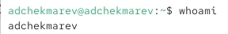{#fig:001 width=60%}

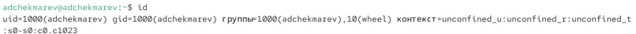{#fig:001 width=80%}

## Информация о пользователе root

- Переключимся на пользователя root и узнаем его подробную информацию

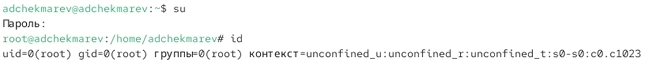{#fig:001 width=100%} 

## Просмотр файла /etc/sudoers

- Просмотрим в безопасном режиме файл /etc/sudoers с помощью команды sudo -i visudo

- Убедимся, что присутствует строка %wheel ALL=(ALL) ALL

{#fig:001 width=35%} 

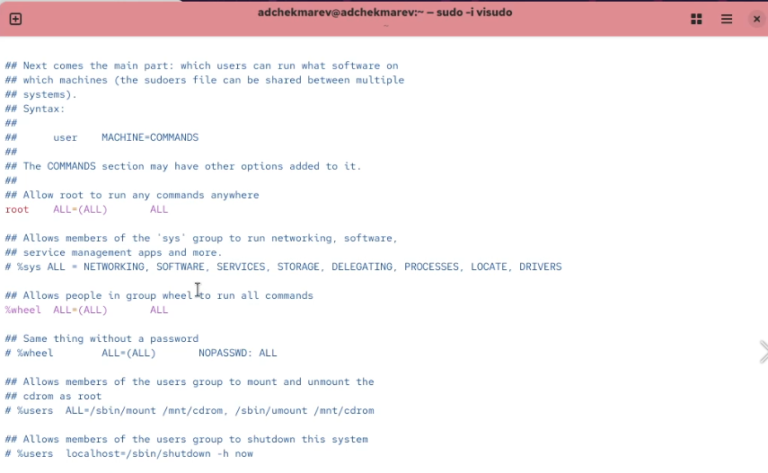{#fig:001 width=65%}

## Создание нового пользователя alice

- Создадим пользователя alice
- Убедимся, что пользователь alice добавлен в группу wheel

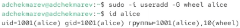{#fig:001 width=65%}

## Настройка пароля

- Зададим пароль для пользователя alice

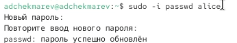{#fig:001 width=65%}

## Создание нового пользователя bob

- Переключимся на учётную запись пользователя alice. Создадим пользователя bob

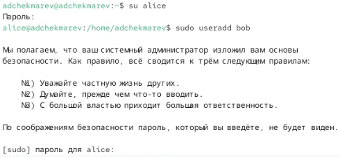{#fig:001 width=65%}

## Настройка пароля и просмотр групп пользователя bob

- Установим пароль для пользователя bob. Просмотрим, в какие группы он входит

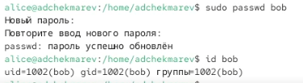{#fig:001 width=65%}

## Просмотр файла /etc/login.defs 

- Переключимся в терминале на учётную запись пользователя root
- Откроем файл конфигурации /etc/login.defs для редактирования

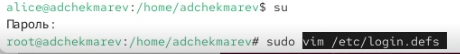{#fig:001 width=65%}

## Измение параметров

- Найдем параметр CREATE_HOME и убедимся, что он установлен в значение yes. Также установим параметр USERGROUPS_ENAB no
- Это позволит не добавлять нового пользователя в группу с тем же именем, что и пользователь, а использовать группу users

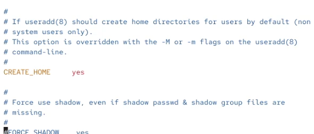{#fig:001 width=35%}

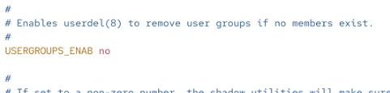{#fig:001 width=35%}

## Создание каталогов

- Перейдем в каталог /etc/skel. Создадим каталоги Pictures и Documents 
- Это позволит добавить эти каталоги по умолчанию во все домашние каталоги пользователей

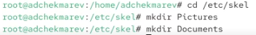{#fig:001 width=65%}

## Изменение файла .bashrc

- Изменим содержимое файла .bashrc, добавив строку export EDITOR=/usr/bin/mceditor
- Эта запись означает, что текстовый редактор vim или редактор mceditor будет установлен по умолчанию для инструментов, которые нуждаются в изменении текстовых файлов

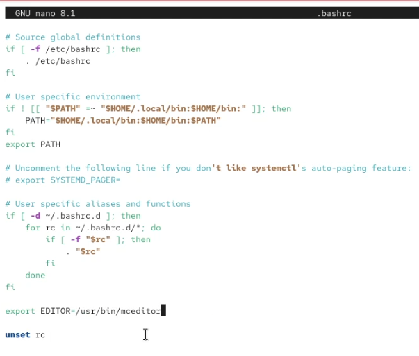{#fig:001 width=35%}

## Создание нового пользователя carol

- Переключимся в терминале на учётную запись пользователя alice
- Используем утилиту useradd, создадим пользователя carol
- Установим пароль для пользователя carol

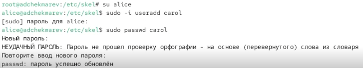{#fig:001 width=80%}

## Просмотр каталогов и иноформации пользователя carol

- Посмотрим информацию о пользователе carol
- Также убедимся, что каталоги Pictures и Documents были созданы в домашнем каталоге пользователя carol

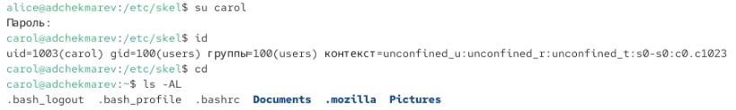{#fig:001 width=100%}

## Просмотр информации о пароле пользователя carol

- Переключимся в терминале на учётную запись пользователя alice
- Просмотрим строку записи о пароле пользователя carol в файле /etc/shadow

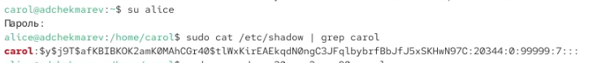{#fig:001 width=80%}

## Изменение свойств пароля пользователя carol

- Изменим свойства пароля пользователя carol
- Убедимся в изменении

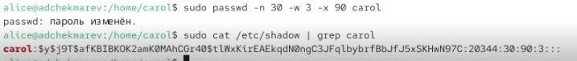{#fig:001 width=80%}

## Проверка индификаторов пользователей alice и carol

- Убедимся, что идентификатор alice существует во всех трёх файлах
- Убедимся, что идентификатор carol существует не во всех трёх файлах

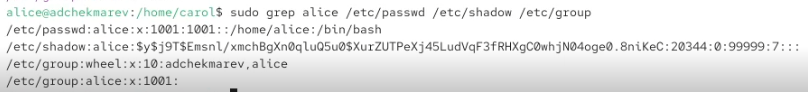{#fig:001 width=70%}
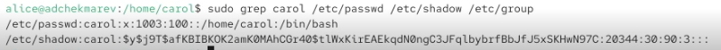{#fig:001 width=70%}

## Создание групп для пользователей

- Находясь под учётной записью пользователя alice, создадим группы main и third

{#fig:001 width=70%}

## Добавление пользователей в группы

- Используем usermod для добавления пользователей alice и bob в группу main, а carol — в группу third

- Убедимся, что пользователь carol правильно добавлен в группу third

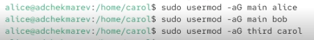{#fig:001 width=65%}

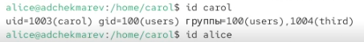{#fig:001 width=65%}

## Информация о других пользователях 

- Определим участников каких групп являются другие созданные нами пользователи

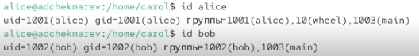{#fig:001 width=70%}

## Вывод:

В ходе работы изучены основы управления учётными записями и группами пользователей в Linux
