---
## Front matter
lang: ru-RU
title: Лабораторная работа №4
subtitle: Работа с программными пакетами
author:
  - Чекмарев Александр Дмитриевич | Группа НПИбд-03-24
institute:
  - Российский университет дружбы народов, Москва, Россия
date: 27 сентября 2025

## i18n babel
babel-lang: russian
babel-otherlangs: english

## Formatting pdf
toc: false
toc-title: Содержание
slide_level: 2
aspectratio: 169
section-titles: true
theme: warsaw

## Fonts
mainfont: Liberation Serif
romanfont: Liberation Serif
sansfont: Liberation Sans
monofont: Liberation Mono
mainfontoptions: Ligatures=TeX
romanfontoptions: Ligatures=TeX
sansfontoptions: Ligatures=TeX,Scale=MatchLowercase
monofontoptions: Scale=MatchLowercase,Scale=0.9
---

# Информация

## Докладчик

:::::::::::::: {.columns align=center}
::: {.column width="70%"}

  * Чекмарев Александр Дмитриевич
  * Группа НПИбд-03-24
  * Российский университет дружбы народов
  * <https://github.com/nenokixd?tab=repositories>

:::
::: {.column width="30%"}

:::
::::::::::::::

# Вводная часть

## Объект и предмет исследования

- Работа с файлами репозиториев и пакетами-rpm

## Цель работы

- Получить навыки работы с репозиториями и менеджерами пакетов.

# Ход лабораторной работы

## Переход в каталог и просмотр содержимого

- Зайдем в режим root. 
- Перейдем в каталог /etc/yum.repos.d и изучим содержание каталога

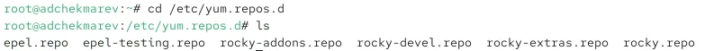{#fig:001 width=80%}

## Просмотр файлов репозитория

- На примере просмотрим файлы rocky-devel.repo и rocky.repo

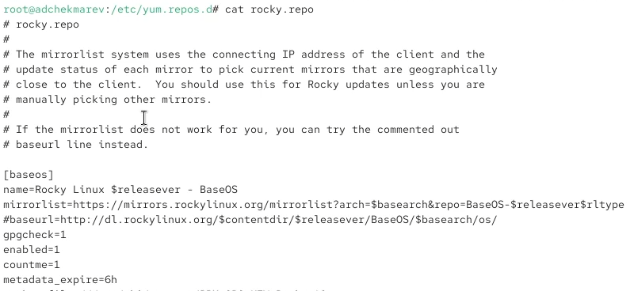{#fig:001 width=50%}  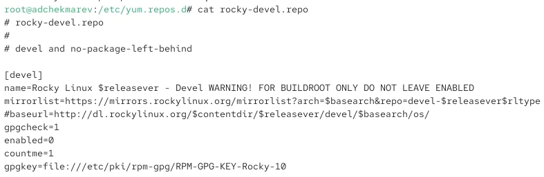{#fig:001 width=50%} 

## Список репозиториев

- Выведем на экран список репозиториев

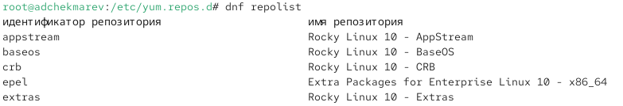{#fig:001 width=70%}

## Список пакетов

- Выведем на экран список пакетов, в названии или описании которых есть слово user

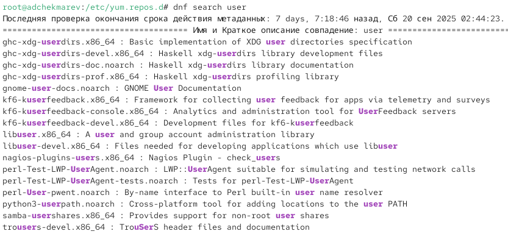{#fig:001 width=65%}

## Просмотр пакетов nmap

- Установим nmap, предварительно изучив информацию по имеющимся пакетам
- Найдем nmap

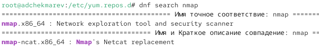{#fig:001 width=70%}

## Просмотр информации nmap

- Просмотрим подробную информацию о нем

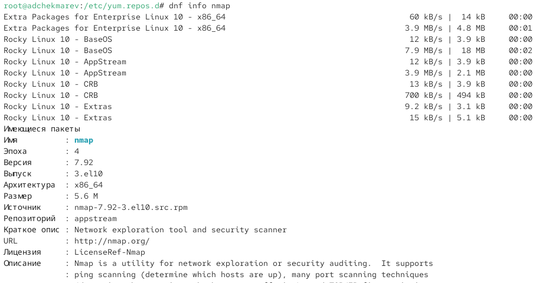{#fig:001 width=65%}

## Установка nmap

- Перейдем к установке nmap

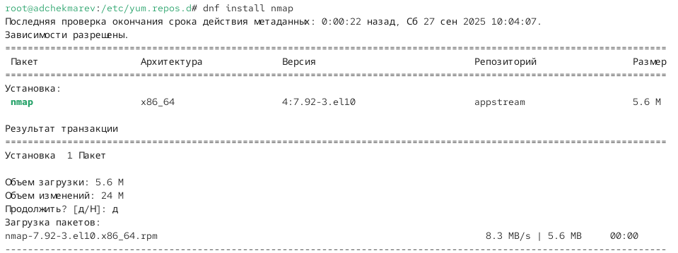{#fig:001 width=75%}

## Установка nmap-ncat

- Установим другие пакеты с началом nmap

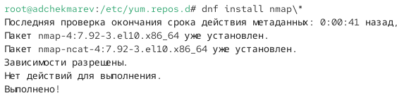{#fig:001 width=70%}

## Удаление nmap

- Удалим как nmap, так и nmap-ncat 

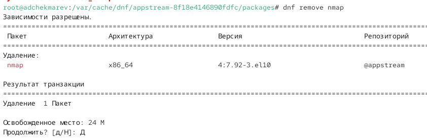{#fig:001 width=50%} 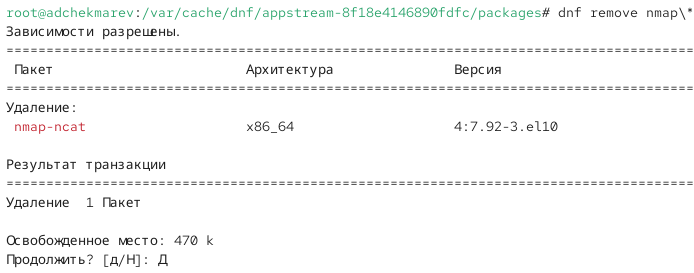{#fig:001 width=50%}

## Группа пакетов RPM Development Tools

- Получим список имеющихся групп пакетов, затем установим группу пакетов RPM Development Tools
- Сначала просмотрим список

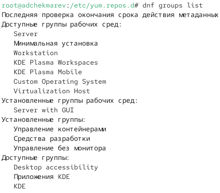{#fig:001 width=45%} 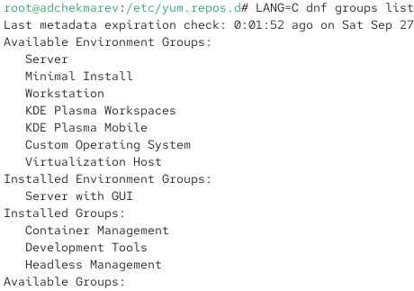{#fig:001 width=45%}

## Просмотр информации о пакете RPM Development Tools

- Узнаем о информацию о группах пакета RPM Development Tools

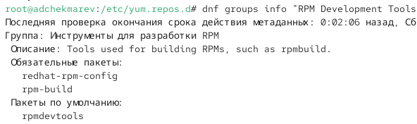{#fig:001 width=70%}

## Установка RPM Development Tools

- Установим RPM Development Tools

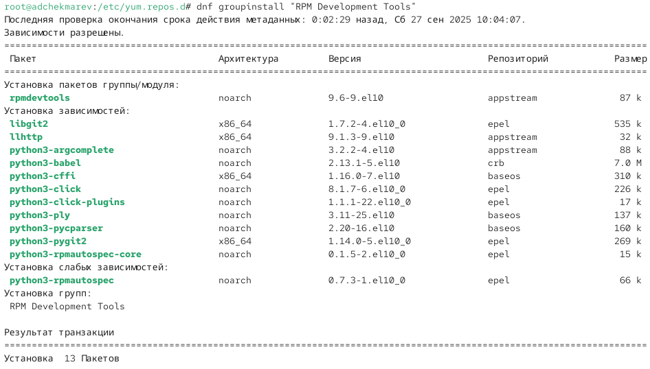{#fig:001 width=70%}

## Удаление группы пакетов RPM Development Tools

- Для удаления группы пакетов RPM Development Tools можно воспользоваться командой **dnf groupremove "RPM Development Tools"**

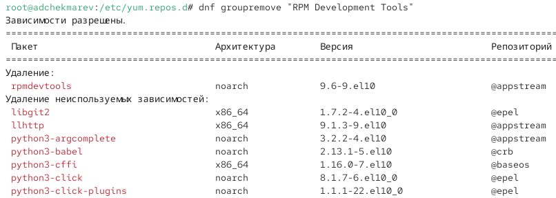{#fig:001 width=60%}

## Просмотр истории команды dnf

- Посмотрим историю использования команды dnf

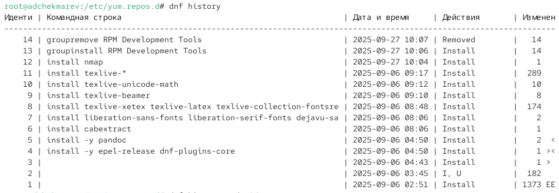{#fig:001 width=70%}

## Отмена одного из последних действий

- Отменим последнее, например 14 по счёту

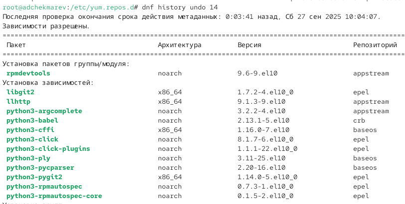{#fig:001 width=60%}

## Скачивание rpm-пакета lynx

- Предположим, что требуется установить текстовый браузер lynx из rpm-пакета
- Посмотрим информацию о пакете и скачаем пакет lynx

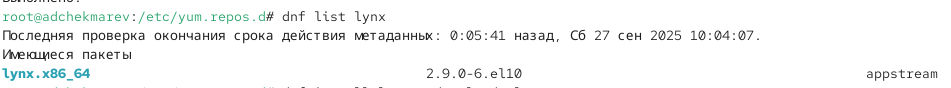{#fig:001 width=70%} 

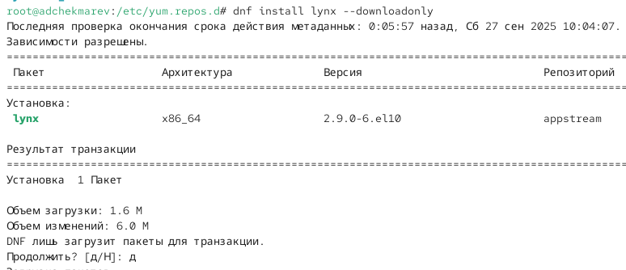{#fig:001 width=65%}

## Поиск каталога и переход

- Найдем каталог, в который был помещён пакет после загрузки
- Перейдем в этот каталог

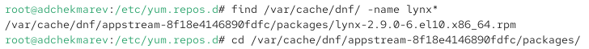{#fig:001 width=70%}

## Установка rpm-пакета и просмотр инофрмации

- Установим rpm-пакет lynx
- Определим расположение исполняемого файла
- Используя rpm, определим по имени файла, к какому пакету принадлежит lynx

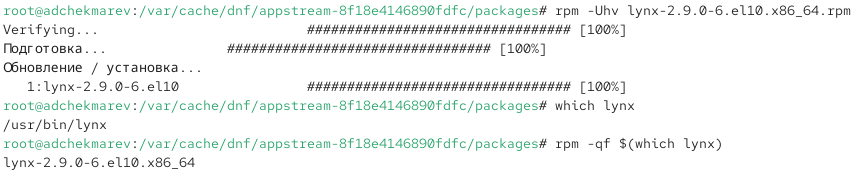{#fig:001 width=75%}

## Просмотр подробной информации о пакете

- Получим дополнительную информацию о содержимом пакета

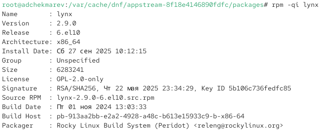{#fig:001 width=70%}

## Просмотр списка всех файлов в пакете

- Получим список всех файлов в пакете

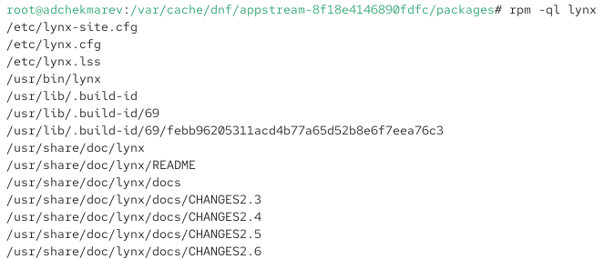{#fig:001 width=70%}

## Просмотр файлов с документацией пакета

- Выведем перечень файлов с документацией пакета

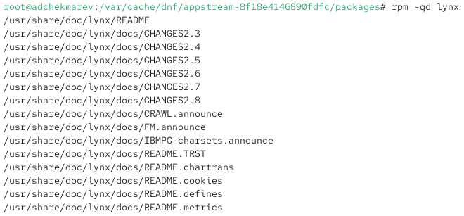{#fig:001 width=70%}

## Просмотр файлов документации

- Посмотрим файлы документации, применив команду **man lynx**

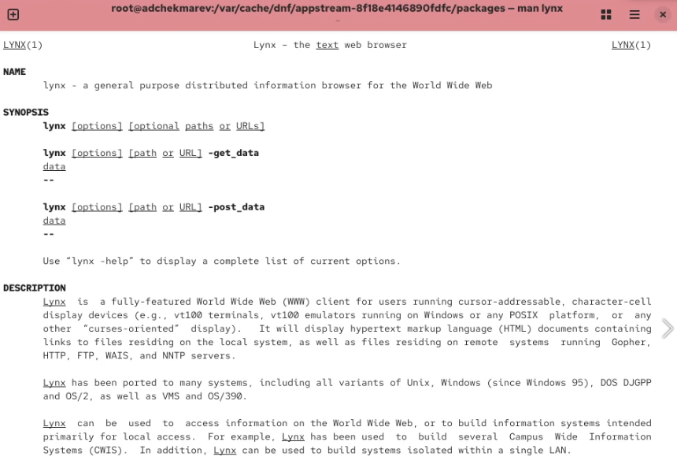{#fig:001 width=70%}

## Просмотр конфигурационных файлов и скриптов

- Выведем на экран перечень и месторасположение конфигурационных файлов пакета
- Выведем на экран расположение и содержание скриптов, выполняемых при установке пакета

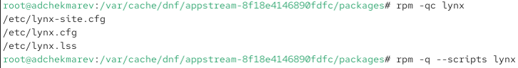{#fig:001 width=75%}

## Проверка работы текстового браузера lynx

- В отдельном терминале запустим текстовый браузер lynx, чтобы проверить корректность установки пакета.

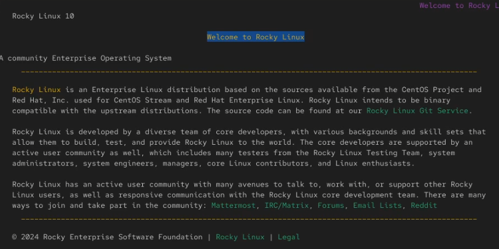{#fig:001 width=70%}

## Удаление lynx

- Вернемся в терминал с учётной записью root и удалим пакет
- Удалим lynx и просмотрим содержимое каталога

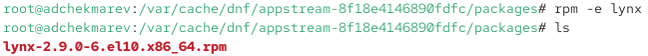{#fig:001 width=75%}

## Пакет dnsmasq

- Предположим, что требуется из rpm-пакетов установить dnsmasq (DNS-, DHCP- и TFTPсервер).
- Просмотрим информации о пакете и установим dnsmasq

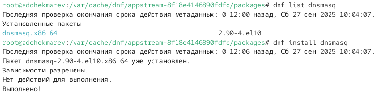{#fig:001 width=70%}

## Просмотр расположения исполняемого файла и определение к какому пакету он принадлежит

- Определим расположение исполняемого файла
- Определите по имени файла, к какому пакету принадлежит dnsmasq

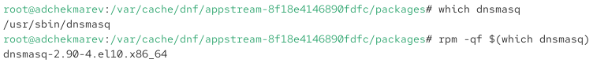{#fig:001 width=75%}

## Просмотр подробной информации о содержимом пакета

- Получим дополнительную информацию о содержимом пакета dnsmasq

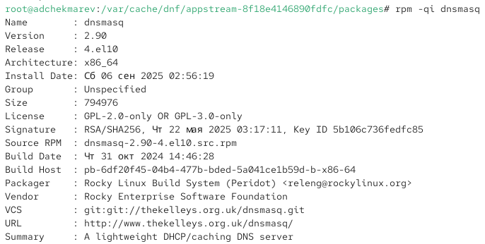{#fig:001 width=70%}

## Просмотр списка всех файлов пакета

- Получим список всех файлов в пакете

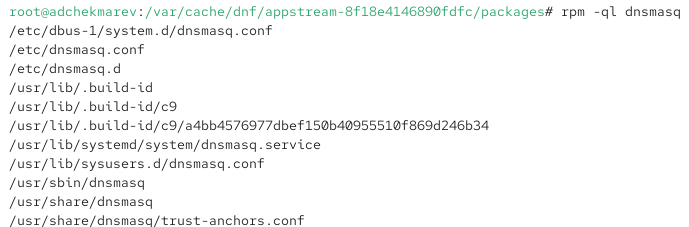{#fig:001 width=70%}

## Просмотр файлов с документацией пакета

- Выведем перечень файлов с документацией пакета

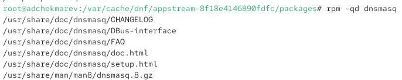{#fig:001 width=75%}

## Просмотр файлов документации

- Посмотрим файлы документации, применив команду **man dnsmasq**

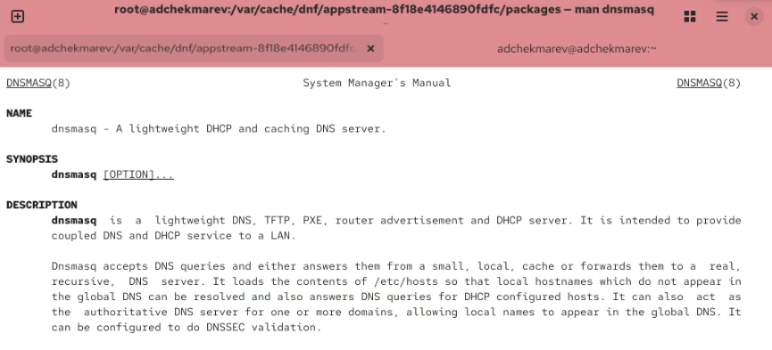{#fig:001 width=70%}

## Просмотр конфигурационных файлов пакета

- Выведем на экран перечень и месторасположение конфигурационных файлов пакета

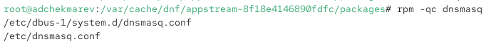{#fig:001 width=75%}

## Просмотр скриптов пакета

- Выведем на экран расположение и содержание скриптов, выполняемых при установке пакета

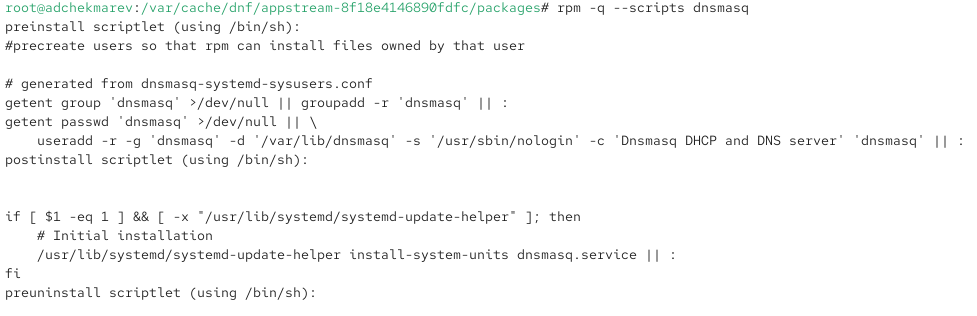{#fig:001 width=75%}

## Удаление пакета

- Вернемся в терминал с учётной записью root и удалим пакет

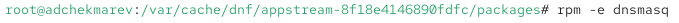{#fig:001 width=75%}

## Вывод:

В ходе работы приобретены навыки работы с репозиториями и менеджерами пакетов
